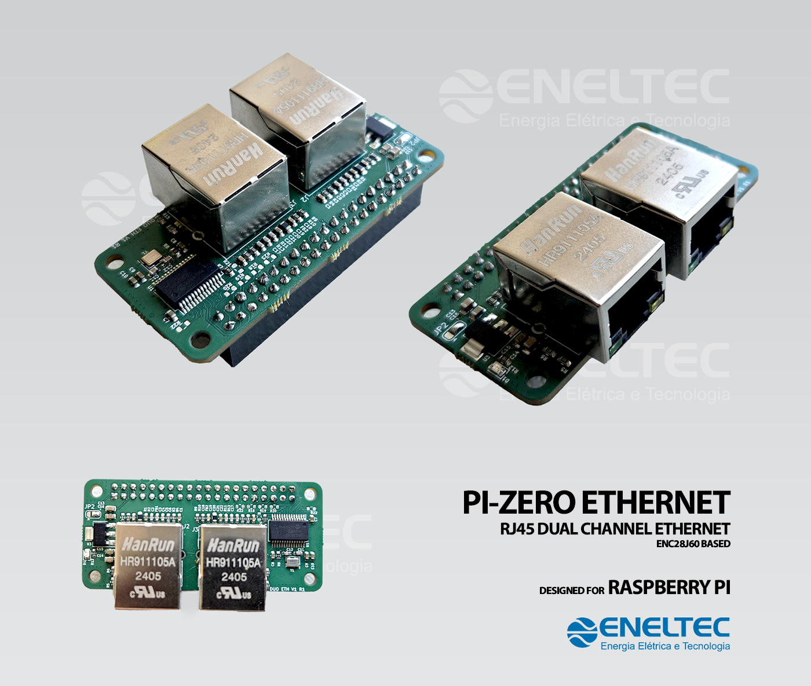

# PiZero-Ethernet by Eneltec



Developed for use in Raspberry Pi Zero 2W
Tested on: Raspberry Pi OS Lite 32-bit, July 4th 2024 | Kernel version: 6.6 | Debian version: 12 (bookworm) | Size: 500MB

This software enables the use of Eneltec dual-Ethernet Hat for use with Raspberry Pi Zero 2W. The hat contains two ENC28J60 modules and creates interfaces ```eth0``` and ```eth1```.
It connects with the Raspberry via SPI1 using cs0 and cs1.

***Check route metrics if having trouble with connection or VPN***

# How to install


To update your device and clone the repository:
```
sudo apt -y update
sudo apt -y upgrade
sudo apt install git -y
sudo git clone https://github.com/ENELTEC/PiZero-Ethernet.git eth

```

# Installation Instructions

## Option 1: Run the `install.sh` script
For an automated installation, simply run the provided script:
(Raspberry Pi OS Lite 32-bit, July 4th 2024 or newer ***only***)

```bash
sudo chmod +x eth/install.sh
sudo sh eth/install.sh
```
## Option 2: Manual Installation
If you prefer to execute the steps manually, follow these commands to move the files and restart the device:

1. Append the contents of `config.txt` to `/boot/firmware/config.txt`:
    ATTENTION: If you are using an older version of Raspbian, the may will be at `/boot/config.txt`
    ```bash
    sudo cat eth/src/config.txt | sudo tee -a /boot/firmware/config.txt
    ```

2. Append the contents of `cmdline.txt` to `/boot/firmware/cmdline.txt`:
    ATTENTION: If you are using an older version of Raspbian, the file may be at `/boot/cmdline.txt`
    ```bash
    sudo cat eth/src/cmdline.txt | sudo tee -a /boot/firmware/cmdline.txt
    ```

3. Compile and move the device tree overlay file:
    ```bash
    sudo dtc -I dts -O dtb -o /boot/firmware/overlays/enc28j60-spi1.dtbo eth/src/enc28j60-spi1.dts
    ```

4. If you are using the NetWorkManager, with ```nmcli connection show``` discover the name of your connection modify its route metric:
    ```bash
    sudo nmcli connection modify my_connection ipv4.route-metric 0
    ```

5. Reboot the device to apply changes:
    ```bash
    sudo reboot
    ```
